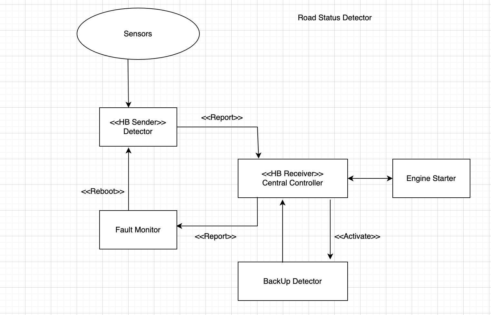

# SWEN-755
    Heartbeat tactic implemetation for autonomous cars
    
    Features:
    - Sensors will sense the obstacles(Pothole, water) on the road and update the detetors accordingly
    
    - Detector (Heart beat sender) will continously send heart beat to the central controller.

    - Fault Monitor will monitor the heart beat and will reboot the detector in case of any failure sensed by the
      central controller.
    

 
    Fault Recovery:
    - The detector process behaves as a heartbeat sender and the status receiver module performs the role of receiving the signals 
        and acknowledging the message received.

    - Fault Monitoring system is activated if the receiver didn't receive any signal from sender(s) within a error buffer duration of 6000ms.
        Fault Monitoring system has a method to handleFault() in order to perform a quick start up for backup sender.

    - Here, the actual detectors (sender) are the active nodes to produce road informaion and the backup sender is a passive node to perform 
        alternate operation in case of primary component failure. We actuate 2 instances of sender process where one looks ahead 1 road step
        and another looks ahead 2 road steps.

    - Given the operation capability and with multiple senders, until all the senders fail and the backup sender is queued to be activated, 
        the receiver module still has some more road information to be processed and simultenously could activate the backup sender. 

    - Once, the backup sender is activated it access the some memory write space for single instance to avoid multiple failures. 
        Hypothetically, if the autonomous car is in motion, the system is expected to fix the active node component. 
    
    - Subsequently, the fault recovery system reboots the primary component sender to it in active state. The reboot initiates with an access
        to write to same memory space with a default of 1 lookup ahead.